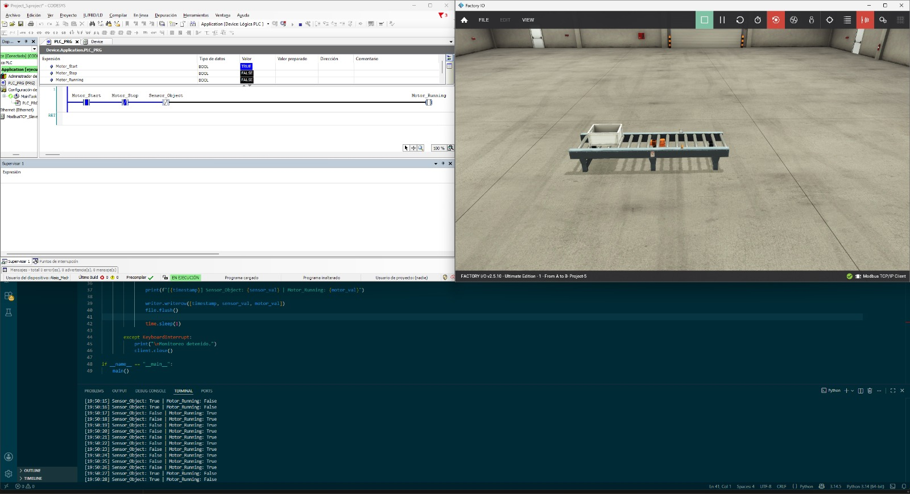
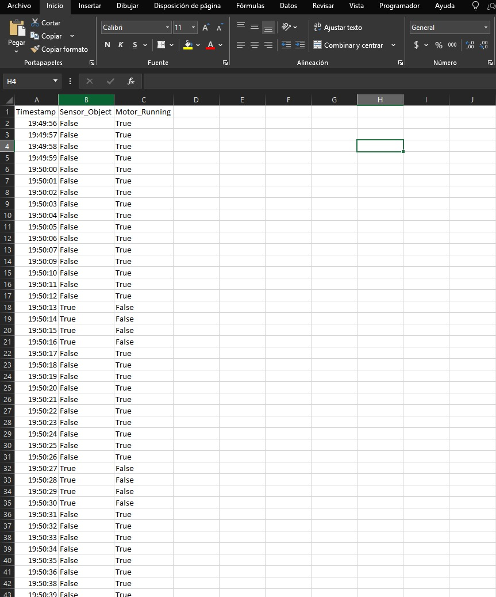

# 🐍 PLC Python Modbus Monitor — Project 6

Real-time PLC data acquisition using Python and Modbus TCP. Reads live signals from a CODESYS SoftPLC connected to a Factory I/O 3D industrial simulation and logs them to CSV for analysis.

---

## 📋 Project Overview

This project bridges industrial PLC automation with data engineering. A Python script connects to a CODESYS SoftPLC via Modbus TCP, reads two process variables every second, prints them to console, and logs them to a CSV file — replicating how real SCADA systems acquire data from field devices.

**Key achievement:** Full Industry 4.0 data acquisition stack running entirely in software.

---

## 🏗️ System Architecture

```
┌─────────────────┐     Modbus TCP      ┌──────────────────┐     3D Simulation
│   CODESYS V3.5  │ ◄─────────────────► │  Factory I/O     │ ──────────────────►
│   SoftPLC SP17  │    127.0.0.1:502    │  Ultimate v2.5   │   Visual Feedback
│   Ladder Logic  │                     │  Scene: A to B   │
└────────┬────────┘                     └──────────────────┘
         │ Modbus TCP
         │ 127.0.0.1:502
┌────────▼────────┐
│   Python Script │ ──────────────────► plc_data_log.csv
│   pymodbus 3.x  │   logs every 1s
└─────────────────┘
```

---

## 📊 Signal Map

| Variable | Type | Modbus Register | Direction |
|---|---|---|---|
| Sensor_Object | BOOL | Coil 0 | Factory I/O → PLC → Python |
| Motor_Running | BOOL | Discrete Input 0 | PLC → Factory I/O + Python |

---

## 🐍 Python Script

### Dependencies

```bash
pip install pymodbus
```

### How it works

```python
client = ModbusTcpClient(host='127.0.0.1', port=502)
```

Every second the script:
1. Reads **Coil 0** → `Sensor_Object` (object detected by physical sensor)
2. Reads **Discrete Input 0** → `Motor_Running` (conveyor belt state)
3. Prints timestamped values to console
4. Appends a row to `plc_data_log.csv`

Press **Ctrl+C** to stop — the connection closes cleanly.

---

## 📁 CSV Output

```
Timestamp,Sensor_Object,Motor_Running
19:49:56,False,True
19:49:57,False,True
19:50:13,True,False   ← sensor detects box, motor stops
19:50:14,True,False
19:50:17,False,True   ← box clears sensor, motor restarts
```

The CSV captures every state change with millisecond-accurate timestamps — the same data format used in industrial historians and SCADA systems.

---

## 🛠️ Tools & Software

| Tool | Version | Purpose |
|---|---|---|
| CODESYS Development System | V3.5 SP17 | PLC programming (Ladder) |
| CODESYS Control Win V3 x64 | 3.5.17.0 | SoftPLC runtime |
| CODESYS Modbus | 4.0.0.0 | Modbus TCP Slave Device |
| Factory I/O | Ultimate v2.5.10 | 3D industrial simulation |
| Python | 3.14.5 | Data acquisition script |
| pymodbus | 3.13.0 | Modbus TCP client library |

---

## ▶️ How to Run

1. Start **CODESYS Control Win V3 x64** from Windows Start Menu → Start PLC
2. Open CODESYS project → Login → Run (F5)
3. Open Factory I/O → Scene "1 - From A to B" → Connect Modbus TCP Client → Play
4. Run the Python script:

```bash
python monitor.py
```

5. Watch real-time data in console. Stop with **Ctrl+C**.
6. Open `plc_data_log.csv` in Excel to analyze the logged data.

---

## 📸 Screenshots

**Full stack running — CODESYS + Factory I/O + Python console**


**CSV data logged to Excel**


---

## 🐛 Troubleshooting

### Connection refused on port 502
Make sure CODESYS Control Win is running and the PLC is in RUN mode before starting the script. Check Windows Firewall is not blocking port 502.

### Device mismatch error in CODESYS
Right-click Device in project tree → Update device → Select CODESYS Control Win V3 x64 v3.5.17.0.

---

## 🗺️ Roadmap Context

This project is **Part 6** of an Industry 4.0 Engineer learning path:

- ✅ Projects 1–4 — PLC fundamentals (TIA Portal, S7-1500)
- ✅ Project 5 — Conveyor Belt Sensor Control (CODESYS + Modbus TCP + Factory I/O)
- ✅ **Project 6 — PLC Python Modbus Monitor (Real-time data acquisition to CSV)**
- 🔜 Project 7 — Industrial Dashboard (InfluxDB + Grafana)

---

## 👩‍💻 Author

**Alexis Medrano** — Control & Automation Engineer | Industry 4.0  
[github.com/AlexisMMMM](https://github.com/AlexisMMMM)
